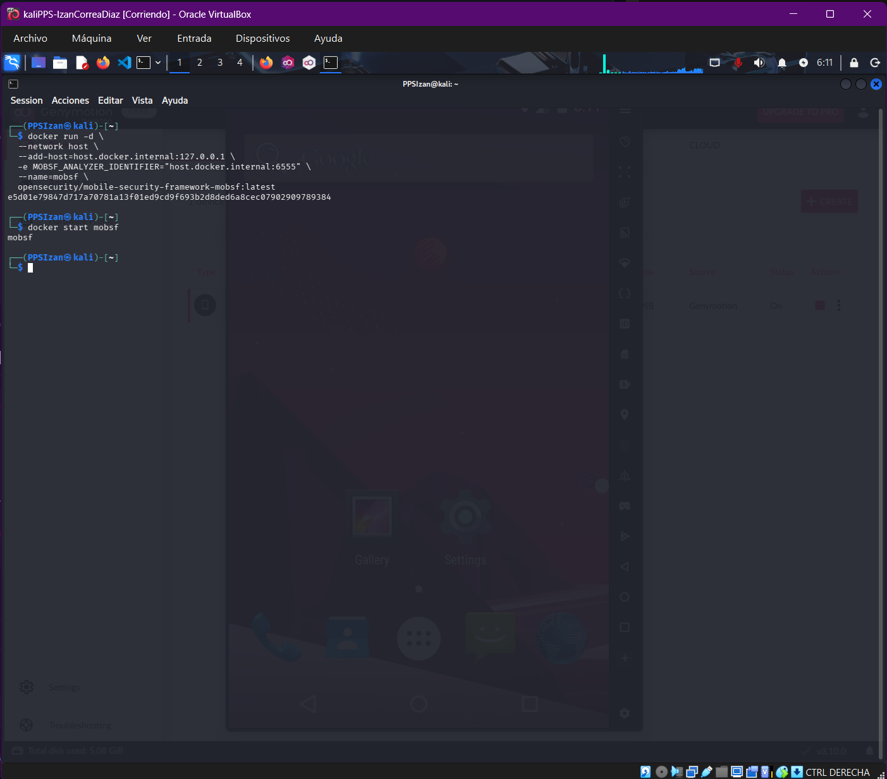
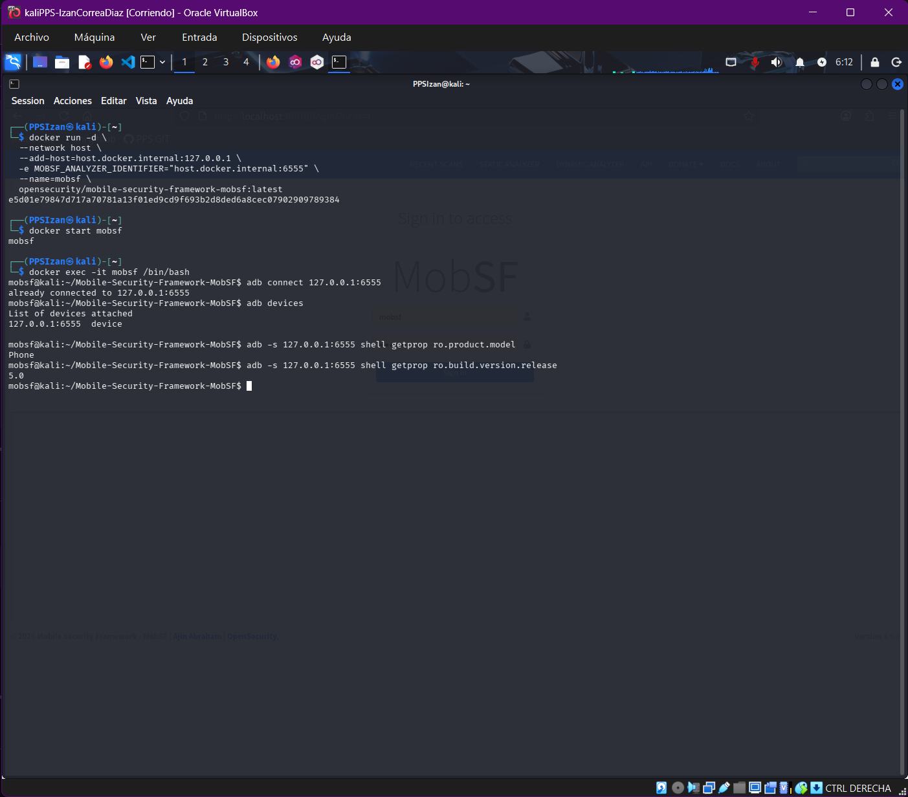
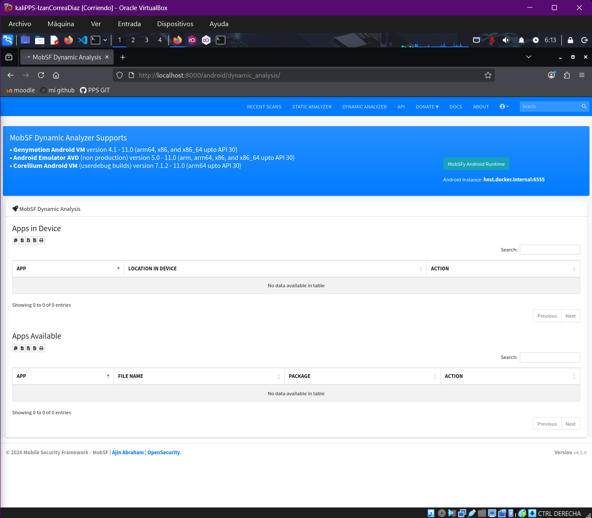
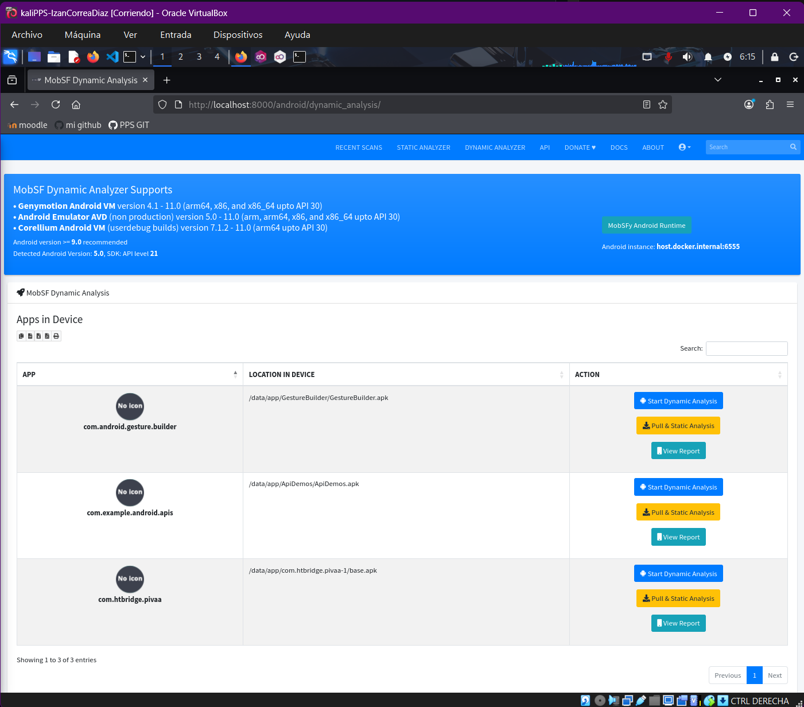
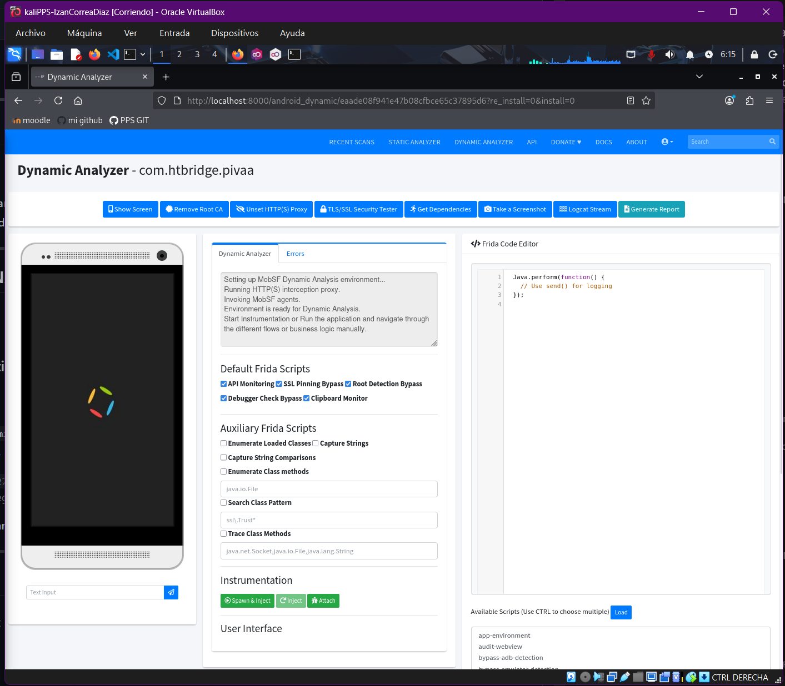

## 1. Crear contenedor Docker de MobSF

```bash
# Si usas VirtualBox en vez de QEMU, usar puerto 5555 en vez de 6555
docker run -d \
  --network host \
  --add-host=host.docker.internal:127.0.0.1 \
  -e MOBSF_ANALYZER_IDENTIFIER="host.docker.internal:6555" \
  --name=mobsf \
  opensecurity/mobile-security-framework-mobsf:latest

# Para iniciar el contenedor si ya existe (no se borra con --rm)
docker start mobsf
```



### Explicación de parámetros:

| Parámetro | Descripción |
|-----------|-------------|
| `--network host` | Usa la red del host en vez de Bridge, conectando perfectamente por ADB con Genymotion |
| `--add-host=host.docker.internal:127.0.0.1` | Crea un host para la conexión de MobSF |
| `-e MOBSF_ANALYZER_IDENTIFIER="host.docker.internal:6555"` | Variable de entorno para conexión ADB al host:puerto |
| `--name=mobsf` | Nombre del contenedor |

---

## 2. Comprobar conexión entre Docker MobSF y el emulador

```bash
# Abrir nueva terminal o pestaña

# Acceder al contenedor
docker exec -it mobsf /bin/bash

# Conectar por ADB al dispositivo
adb connect 127.0.0.1:6555
# Debe indicar: already connected to 127.0.0.1:6555

# Listar dispositivos
adb devices
# Debe aparecer: 127.0.0.1:6555  device

# Verificar modelo y versión
adb -s 127.0.0.1:6555 shell getprop ro.product.model
# Debe indicar: Nexus 5

adb -s 127.0.0.1:6555 shell getprop ro.build.version.release
# Debe indicar: 7.1
```



---

## 3. Acceder a MobSF

Abrir navegador y acceder a:
```
http://localhost:8000
```

Autenticarse con:
- Usuario: `mobsf`
- Contraseña: `mobsf`

---

## 4. ANÁLISIS ESTÁTICO

1. Seleccionar **STATIC ANALYZER**
2. Arrastrar y soltar `Pivaa.apk`
3. Analizar los resultados obtenidos (serán la base del análisis dinámico)
4. Identificar problemas para comprobar en el análisis dinámico

---

## 5. LANZAR ENTORNO DE ANÁLISIS DINÁMICO

1. Pulsar en **DYNAMIC ANALYZER**
2. Lanzar **Android Dynamic Analyzer**



### Comprobar conexión MobSF - Android Runtime:

1. Pulsar **MobSFy Android Runtime**
2. Pulsar botón **MobSFy**
3. Verificar mensaje: `Successfully created MobSF Dynamic Analysis environment. MobSF agents and Frida server installed.`
4. Comprobar que aparece `Pivaa` en apps disponibles

> **Si no aparece:** Cambiar `host.docker.internal` por `127.0.0.1` en la configuración de MobSF Android Runtime, quedando `127.0.0.1:6555`. Cerrar configuración y refrescar navegador.



5. Seleccionar `com.htbridge.pivaa` y pulsar **Start Dynamic Analysis**



En el archivo `lockfile` de Application Data se pueden ver las credenciales introducidas.
